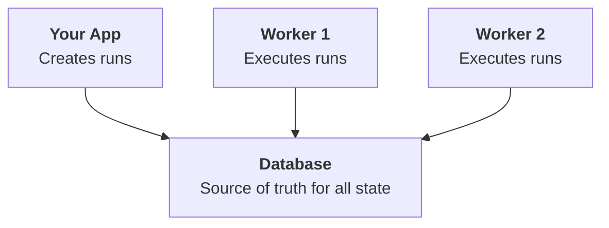

OpenWorkflow runs entirely in your infrastructure. There are no external
servers to connect to or third-party services to manage. Your database
(PostgreSQL or SQLite) is the only dependency, and it stores all workflow
state.

This page covers what you need to know for production deployments: database
setup, worker scaling, and monitoring.

## Architecture Overview

OpenWorkflow uses a **worker-driven architecture**:

1. **Workers** run in your infrastructure and poll the database for work
2. **Clients** create workflow runs by writing to the database
3. **Database** (PostgreSQL or SQLite) stores all workflow state

There's no central orchestration server. Workers coordinate through the
database, making the system simple to deploy and operate.



## Requirements

For most production use cases, use PostgreSQL 14 or later:

- The connecting user needs permissions to create schemas and tables (for
  migrations)
- Workflow state is stored in the configured schema (default: `openworkflow`)

For single-server deployments, SQLite works well.

## Production Setup

### 1. Set Up PostgreSQL

Provision a PostgreSQL database. Any PostgreSQL 14+ instance works.

### 2. Configure the Backend

Edit your `openworkflow.config.ts` to set the Postgres URL and namespace:

```ts
import { defineConfig } from "@openworkflow/cli";
import { BackendPostgres } from "openworkflow/postgres";

export default defineConfig({
  backend: await BackendPostgres.connect(
    process.env.OPENWORKFLOW_POSTGRES_URL!,
    {
      namespaceId: process.env.OPENWORKFLOW_NAMESPACE_ID || "production",
      schema: process.env.OPENWORKFLOW_SCHEMA || "openworkflow",
    },
  ),
  dirs: ["./openworkflow"],
  worker: {
    concurrency: 10,
  },
});
```

In this example, we use `OPENWORKFLOW_POSTGRES_URL`,
`OPENWORKFLOW_NAMESPACE_ID`, and `OPENWORKFLOW_SCHEMA` env vars to dynamically
set the Postgres URL, namespace, and schema, but you can set this up however
you'd like.

### 3. Migrations

Migrations run automatically when the backend connects. OpenWorkflow creates:

- `<schema>.workflow_runs` - Stores workflow run state
- `<schema>.step_attempts` - Stores step execution history

### 4. Deploy Workers

<CodeGroup>
```bash npm
npx @openworkflow/cli worker start
```

```bash pnpm
pnpx @openworkflow/cli worker start
```

```bash bun
bunx @openworkflow/cli worker start
```

</CodeGroup>

## Scaling Workers

### Horizontal Scaling

You can run multiple worker instances for high availability and throughput.
Workers coordinate through the database:

- Each workflow run is claimed by exactly one worker at a time
- Workers use atomic database operations to prevent duplicate processing
- If a worker crashes, its workflows automatically become available to others

### Concurrency Tuning

The `concurrency` setting controls how many workflow runs a single worker
processes simultaneously. Each workflow occupies one slot while executing.

```ts
worker: {
  concurrency: 10, // Process up to 10 workflows at once
}
```

**Guidelines:**

- Start with `concurrency: 10` and adjust based on workload
- Increase for I/O-bound workflows (lots of API calls, database queries)
- Decrease for CPU-bound workflows (heavy computation)
- Monitor database connection usage - each worker maintains a connection pool

## Monitoring

### Dashboard

OpenWorkflow includes a built-in dashboard for monitoring:

<CodeGroup>
```bash npm
npx @openworkflow/cli dashboard
```

```bash pnpm
pnpx @openworkflow/cli dashboard
```

```bash bun
bunx @openworkflow/cli dashboard
```

</CodeGroup>

The dashboard shows:

- Workflow run status (pending, running, sleeping, completed, failed)
- Step execution history
- Error details and retry attempts
- Real-time updates

The dashboard does not include built-in authentication. We recommend deploying
it behind a VPN, private network, or Basic Auth proxy to prevent unauthorized
access.
